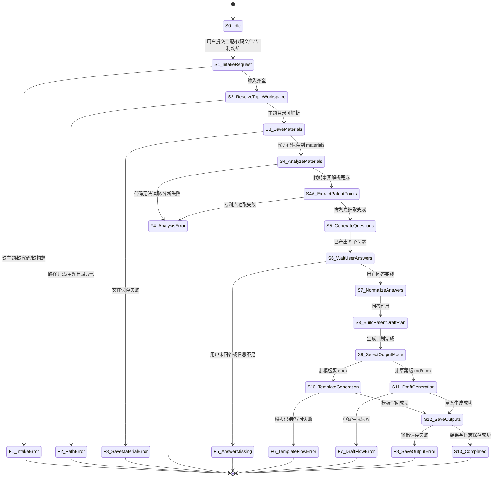
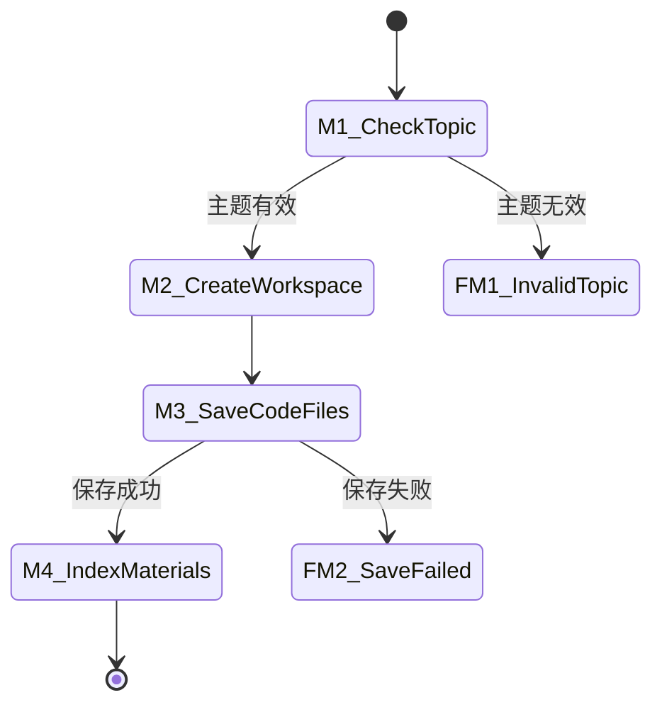
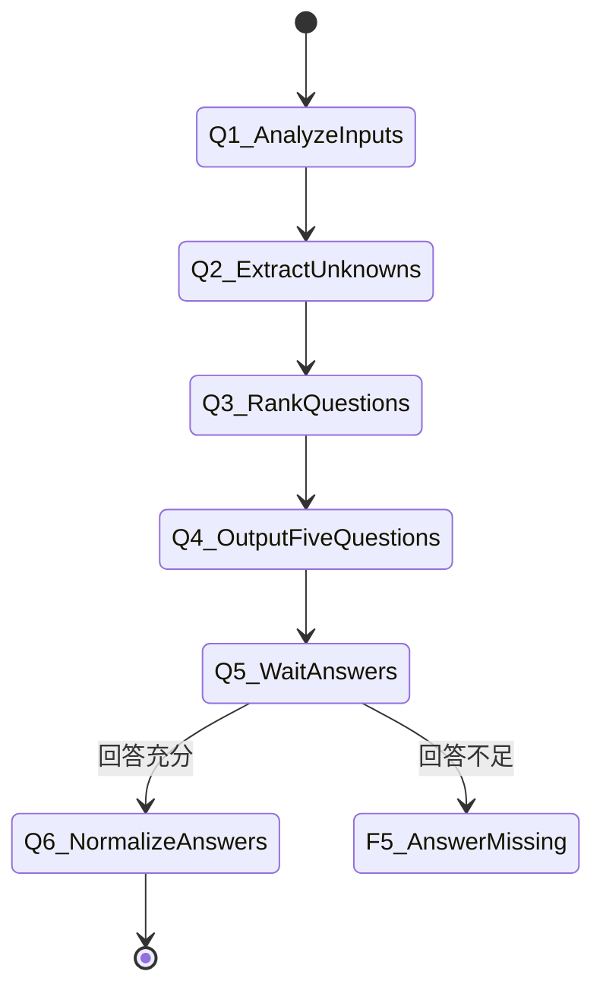
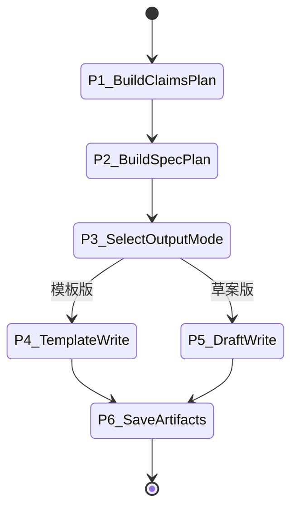

# Workflow State Machine

本文将当前项目的工作流更新为“资料驱动型专利生成状态机”。

这次更新后的核心目标是：

1. 用户上传代码文件和专利构想。
2. 系统先分析资料。
3. 系统提出 5 个关键问题。
4. 用户回答后，系统再生成专利内容。
5. 代码文件必须保存到 `topics/<主题>/materials/`。
6. 生成内容保存到对应主题目录，便于后续迭代改进。
7. 除 `S5_GenerateQuestions` / `S6_WaitUserAnswers` 的 5 个澄清问题外，其余步骤默认由系统自动连续执行，不再逐步向用户确认。

适用范围：

- 项目根目录：[C:\Users\user\Documents\word](/C:/Users/user/Documents/word)
- 生成入口：[main.py](/C:/Users/user/Documents/word/word_template_skill/main.py)
- 模板目录：[templates](/C:/Users/user/Documents/word/templates)
- 主题目录：[topics](/C:/Users/user/Documents/word/topics)

## 1. 更新后的总体状态机



## 2. 与旧状态机相比的关键变化

旧状态机是“模板 + topic 字符串驱动”。

新状态机变成“主题 + 代码文件 + 专利构想 + 问答澄清驱动”。

最重要的变化有 4 个：

1. 在生成前新增了“资料入库态”。
   代码文件不再只是临时附件，而是必须进入 `topics/<主题>/materials/`。

2. 在生成前新增了“两段式分析态”。
   系统先做代码事实解析，再由大模型提炼真正值得保护的专利点，而不是立即写正文。

3. 在生成前新增了“5 问题澄清态”。
   问题生成成为正式状态，而不是一次随手提问。
   同时，这也是默认流程中唯一需要直接与用户交互的停顿点。

4. 在生成阶段新增了“输出模式选择态”。
   后续可以根据需要选择模板版 `docx` 或草案版 `md/docx`。

## 3. 主状态定义

### `S0_Idle`

空闲态。

等待用户提交：

- 专利主题
- 代码文件
- 专利构想

### `S1_IntakeRequest`

接收并校验用户输入。

输入：

- 主题名称
- 一个或多个代码文件
- 专利构想描述

成功条件：

- 三类输入至少满足当前任务最小集合

失败转移：

- `F1_IntakeError`

典型失败原因：

- 只有主题，没有代码或构想
- 给了代码，但没有说明要围绕什么发明点写

### `S2_ResolveTopicWorkspace`

定位或创建主题目录。

输出结构：

```text
topics/<主题>/
  materials/
  notes/
  outputs/
```

要求：

- 若主题目录不存在，则自动创建
- 若已存在，则复用原目录

失败转移：

- `F2_PathError`

### `S3_SaveMaterials`

把用户上传的代码文件保存到主题目录的 `materials/`。

固定要求：

- 代码文件必须保存到 `topics/<主题>/materials/`

可选行为：

- 保留原文件名
- 如重名则自动加后缀
- 在 `notes/` 中记录本轮资料入库信息

成功输出：

- 可追踪的本地代码路径

失败转移：

- `F3_SaveMaterialError`

### `S4_AnalyzeMaterials`

分析代码文件与专利构想中的“稳定事实”。

分析对象：

- 代码结构
- 核心模型/算法流程
- 输入输出定义
- 已实现的训练策略
- 关键类、函数、模块、常量
- 与用户构想的对应关系

当前建议输出：

- 一份“代码事实与候选实现特征说明”

失败转移：

- `F4_AnalysisError`

### `S4A_ExtractPatentPoints`

基于 `S4_AnalyzeMaterials` 的代码事实和用户专利构想，由大模型进行语义层专利点抽取。

抽取目标：

- 哪些实现细节构成发明点
- 哪些只是工程常规配置
- 哪些点适合进入独立权利要求
- 哪些点只适合写入从属权利要求或实施例
- 后续权利要求主线如何组织

当前建议输出：

- 一份“专利点抽取说明”
- 核心专利点
- 可选专利点
- 不建议进入权利要求的工程细节
- 5 个贴代码本身的澄清问题
- 后续权利要求主线

失败转移：

- `F4_AnalysisError`

### `S5_GenerateQuestions`

基于 `S4A_ExtractPatentPoints` 的抽取结果生成 5 个关键问题。

约束：

- 问题数量固定为 5 个
- 问题应服务于后续专利写作，而不是泛泛提问
- 优先问保护范围、输入定义、关键结构细节、实施方式细度、技术效果证据
- 问题应尽量贴近代码中的具体模块与边界，而不是泛泛而谈
- 这 5 个问题应直接在对话中向用户提出，而不是仅写入中间文件等待用户自行查阅
- 除这 5 个问题外，不额外拆出新的人工确认步骤

成功输出：

- 5 个面向专利写作的关键问题

### `S6_WaitUserAnswers`

等待用户回答 5 个问题。

这是一个显式等待态，不生成正文。

交互规则：

- 系统在该状态直接收集用户对 5 个问题的回答
- 用户一旦完成回答，系统默认继续执行 `S7 -> S13`
- 不再就材料分析、专利点抽取、生成计划、模板写回等中间步骤逐项向用户重复确认

输入：

- 用户对 5 个问题的回答

失败转移：

- `F5_AnswerMissing`

触发失败的典型情况：

- 只回答了很少一部分
- 回答与问题严重错位
- 回答不足以支撑正文生成

### `S7_NormalizeAnswers`

把用户回答转成可写作的结构化信息。

输出建议字段：

- `core_innovation_priority`
- `signal_definition`
- `module_granularity`
- `claim_scope_preference`
- `technical_effect_focus`

目的：

- 让后续生成环节不直接依赖自然语言碎片

### `S8_BuildPatentDraftPlan`

根据代码、构想和回答构建专利生成计划。

计划内容应包括：

- 独立权利要求主线
- 从属权利要求补强点
- 说明书摘要重点
- 技术背景问题陈述
- 发明内容的结构顺序
- 具体实施方式与代码的映射关系

这是“从资料分析”转到“正式写作”的桥梁状态。

### `S9_SelectOutputMode`

选择输出模式。

当前推荐保留两条路径：

1. 模板版 `docx`
2. 草案版 `md/docx`

建议规则：

- 如果用户明确要求按模板生成，进入 `S10_TemplateGeneration`
- 如果用户只要求快速迭代草案，可进入 `S11_DraftGeneration`

### `S10_TemplateGeneration`

按 `docx` 模板生成专利内容。

依赖：

- [专利模板.docx](/C:/Users/user/Documents/word/templates/专利模板.docx)
- [main.py](/C:/Users/user/Documents/word/word_template_skill/main.py)

当前子流程仍然可沿用原模板工作流：

1. 读取模板
2. 识别标题
3. 构建章节 Prompt
4. 逐节生成
5. 写回模板副本

但和旧流程的差别是：

- Prompt 输入不应只包含 `topic`
- 还应包含代码分析结果、专利构想摘要、5 问题回答的结构化结果

失败转移：

- `F6_TemplateFlowError`

### `S11_DraftGeneration`

生成非模板版草案。

适合场景：

- 先快速迭代专利内容
- 先收紧权利要求结构
- 先做代码与发明点映射文稿

输出可包括：

- `md`
- 普通 `docx`
- 说明书草案
- 代码映射说明

失败转移：

- `F7_DraftFlowError`

### `S12_SaveOutputs`

保存输出结果。

建议至少保存：

- `outputs/<文件>.docx` 或 `md`
- `notes/<代码与专利映射>.md`
- 运行日志或本轮记录

如果是模板流，保存：

- 模板版 `docx`
- `.log.json`
- `.run.log`

### `S13_Completed`

完成态。

最终结果应满足：

1. 代码文件已落入 `topics/<主题>/materials/`
2. 专利相关说明或草案已落入 `notes/` 或 `outputs/`
3. 后续可以基于同一主题目录继续迭代

## 4. 更新后的子状态机

### 4.1 资料摄取子状态机



### 4.2 问题澄清子状态机



### 4.3 专利生成子状态机



## 5. 更新后的异常状态

### `F1_IntakeError`

资料接收失败。

补救方向：

- 让用户补充主题
- 上传代码文件
- 补充专利构想

### `F2_PathError`

主题目录解析失败。

补救方向：

- 检查主题名是否合法
- 检查 `topics/` 根目录可写性

### `F3_SaveMaterialError`

代码保存失败。

补救方向：

- 检查源文件是否存在
- 检查 `materials/` 目录权限

### `F4_AnalysisError`

代码或构想分析失败。

典型原因：

- 代码文件无法读取
- 文件编码异常
- 代码过大且未完成分段分析

### `F5_AnswerMissing`

用户回答不足以继续生成。

补救方向：

- 再次聚焦提问
- 明确告诉用户缺少哪类信息

### `F6_TemplateFlowError`

模板版生成失败。

典型原因：

- 模板标题识别失败
- 模板路径错误
- 写回占位符失败

### `F7_DraftFlowError`

草案生成失败。

典型原因：

- 分析结果未成功传入写作态
- 权利要求与说明书规划冲突

### `F8_SaveOutputError`

最终输出保存失败。

## 6. 新状态机对当前项目代码的含义

这次更新后，你的项目不应该再被理解为“只要给个 topic 就能生成”。

更准确的理解是：

1. `topic` 决定主题工作区。
2. `materials/` 存放本轮进入工作流的代码文件。
3. `notes/` 存放分析说明、问题、回答整理、映射关系。
4. `outputs/` 存放最终专利草案或模板版 Word。

也就是说，`topics/<主题>/` 不再只是输出目录，而是该主题的完整工作上下文容器。

## 7. 下一步最值得改造的 3 个点

### 改造点 A：让 `materials/` 真正进入 Prompt

现在理想状态机已经要求这一点，但你现有代码主入口还没有自动读取 `materials/`。

建议新增一个“资料摘要器”，把代码文件解析结果注入章节 Prompt。

### 改造点 B：把“5 个问题”做成固定状态输出

这一步不应再是临时问答，而应成为标准产物。

建议保存到：

- `notes/问题清单_<时间戳>.md`
- `notes/回答归一化_<时间戳>.md`

### 改造点 C：在模板生成前插入“专利规划态”

目前模板流容易直接开始写章节。

更新后建议先产出：

- 权利要求主线
- 从属权利要求补强点
- 摘要重点
- 实施方式结构

再进入模板回填。

## 8. 建议的后续版本

如果你后面继续改流程，我建议把状态机再细化成一份“执行表”。

推荐字段：

- `State`
- `Input`
- `Guard`
- `Action`
- `Artifact`
- `Next`
- `Failure`

这样你后面每改一步，都能明确知道：

- 要不要新增状态
- 还是只改某个状态的动作
- 会不会影响上下游产物

现在这份文档已经能作为你后续改造流程的主参考。EOF
